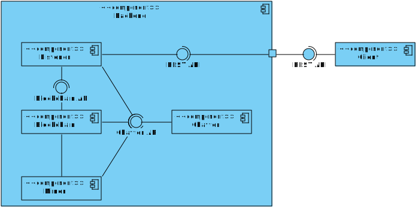

# Noobcash 
## Semester project for [Distributed Systems](http://www.cslab.ece.ntua.gr/courses/distrib/) @ ECE NTUA (fall 2018)

Noobcash is a primitive cryptocurrency, backed by the "noobcash blockchain" (see `doc/assignment.pdf` for the specification, in
Greek). This is our implementation of it.

### Architecture

All communication is realized by a REST API (we would probably use an asynchronous messaging protocol if we were to start from
scratch now). Each node on the noobcash network runs the noobcash "daemon" (or "backend" in web-app terms), realized by a Flask
application. This is tasked with maintaining the wallet, the node's version of the blockchain, listening and talking on the
network, as well as listening for the local client's requests. In addition, a client application (running locally on a node) is
used to create new transactions, sending coins from the local node's wallet to any other node, talking to the local "daemon".

#### Storage

Redis is used to store the blockchain (and the pending transaction pool, wallet, UTXO pool, everything) on each node.

#### Mining

Proof-of-work mining is realized by a separate miner process (see `noobcash/blockchain/miner.py`) to side-step CPython's
[GIL](https://wiki.python.org/moin/GlobalInterpreterLock).

### Configuration (e.g. difficulty and capacity)
- Defaults are defined in `noobcash/__init__.py`
- `instance/config.py` overrides them (stays out of source control)
- The contents of the file pointed to by the NOOBCASH_SETTINGS environment variable (if set) overrides all of the above

### Settings (e.g. FLASK_APP, only applicable if using `flask run`)
- Defaults in `.flaskenv`
- `.env` overrides them (stays out of source control)
- environment variables override all of the above

### Contributors
- Xefteris Michalis
- Xenakis Fotis
- Petrongonas Evangelos
